# Singapore HDB Resale Market Analysis and Price Prediction

We all know that for the HDB flats in Singapore, certain areas are more expensive, while other areas are more affordable. For many people, the most important question is: given my budget, what can I afford?

**However, as smart consumers, we want to get the best value for our money and go on a bargain hunt. For example:**

**-- I would prefer newer flats (fewer maintenance issues)**

**-- I want a location that is affordable but also have good price appreciation potential over the long run.**

**-- I want a location that I have the bargaining power, e.g. I want the sellers to chase after me, so that I get to pick and choose and negotiate hard.**

**-- I want to find out how much the previous owner paid for his/her flat, so that I know how much room I can negotiate down.**

**-- And then finally, given my budget, what can I afford while also meeting all the conditions above?**

**Interested to find out more? Hopefully this analysis can help!**

This portfolio report consolidates the outputs from the two HTML analysis reports:

1. **`singapore_hdb_resale_trends.html`** — geospatial market trend analysis  
2. **`singapore_hdb_resale_prediction.html`** — supervised machine-learning price prediction

It is written as a **standalone analysis report**: the code and `.head()` previews are intentionally excluded, while the **tables, figures, plots, and interactive map outputs** are retained and interpreted.

## Files included in this package

- `README.md` — this report
- `assets/` — all extracted figures used below
- `interactive_maps/` — extracted interactive maps from the trends report
- `singapore_hdb_resale_trends.html` — original full trends report
- `singapore_hdb_resale_prediction.html` — original full prediction report

---

# Executive summary

## High-level conclusions

### From the market trends analysis
- **Location is the main price driver.** The highest current resale prices are concentrated in central and mature estates, especially around the Central Area and strong transit nodes.
- **Recent growth is more geographically dispersed than current price level.** The most expensive places are not always the fastest-rising ones.
- **Transit accessibility matters.** Overlaying MRT/LRT infrastructure makes it clear that well-connected buildings often sit in stronger price bands.
- **The market is not only expensive in the core; it is also dynamic in outer towns.** Several non-core buildings show very large five-year gains.

### From the price prediction analysis
- **Non-linear tree models clearly outperform simpler baselines.**
- **LightGBM is the strongest final model** in the notebook, with **RMSE = 26,247**, **MAE = 18,695**, **R² = 0.9803**, and **MAPE = 3.66%**.
- Compared with Linear Regression, LightGBM reduces RMSE by about **52.1%** and MAE by about **54.7%**.
- **Lease remaining, floor area, and precise location (latitude/longitude)** are among the most influential variables, which is economically intuitive for resale housing.

---

# Part I — `resale_trends`: geospatial market trend analysis

## Main approach

This notebook treats the HDB resale market as a **spatial trend-analysis problem**. Its workflow is:

1. Load official resale transaction data
2. Clean and standardize raw fields
3. Geocode each unique building
4. Aggregate repeated transactions to the **building level**
5. Compute:
   - current price level
   - five-year percentage change
6. Overlay MRT/LRT line and station layers
7. Produce both **static figures** and **interactive maps**

#### Unless otherwise stated:

-- "psm": price per square meter in Singapore Dollar (SGD)

-- "psf": price per square feet in Singapore Dollar (SGD)

-- "current" or "now": **March 2026 (or April 2025 - March 2026)**

-- "base" or "5 years ago": March 2021 (or April 2020 - March 2021)

-- The psm and psf figures are presented as "median price per building over a 12-month period.

   This is because:
   
   (1) there may not be many transactions in a building each month, so it is more meaningful to look over 12 months.
   
   (2) taking a median value will avoid the influence by unusually high or unusually low values.
   
   (3) psm and psf already adjust for the area of an apartment (e.g. even in the same building, a 5-Room flat is obviously more expensive than a 3-Room flat), so we can focus our attention on other factors.

## Why this method is useful

This approach is stronger than reading raw transaction tables directly because transaction-level records are repetitive and noisy for spatial interpretation. Building-level summaries make it much easier to answer practical questions such as:

- Where are current prices highest?
- Which buildings have appreciated the most over five years?
- How closely do price clusters align with MRT/LRT accessibility?

## Key summary table from the trends report

### Summary of Overall Trends Across Singapore

| Parameters         |  No.txn |   Btm 2% |   Median |    Top 2% |
|:-------------------|--------:|---------:|---------:|----------:|
| Price/M2  psm Y2026|    7949 |$4,869.29 |$6,263.74 |$10,946.20 |
| Price/Ft2 psf Y2026|    7949 |  $452.38 |  $581.92 | $1,016.94 |
| psm growth vs Y2021|    6394 |    18.9% |   45.74% |    72.63% |
| psf growth vs Y2021|    6394 |    18.9% |   45.74% |    72.63% |

**Interpretation**

- The median current price is about **6,264 SGD per sqm** and **582 SGD per sqft**.
- Five-year change has a median of about **45.7%**, which indicates a very strong broad market upswing over the analysis window.
- The wide spread between the 2nd and 98th percentiles confirms that both current prices and growth are highly uneven across space.

## Most Expensive Buildings in Y2026

|   Postal | Address           | Town         |     psm Y2026 |     psf Y2026 | No.txn last 12 mth |
|---------:|:------------------|:-------------|--------------:|--------------:|-------------------:|
|    85201 | 1B CANTONMENT RD  | CENTRAL AREA |     $14,947.4 |     $1,388.66 |                  5 |
|    85401 | 1D CANTONMENT RD  | CENTRAL AREA |     $14,939.9 |     $1,387.96 |                  6 |
|    85301 | 1C CANTONMENT RD  | CENTRAL AREA |     $14,759.2 |     $1,371.18 |                 12 |
|    85101 | 1A CANTONMENT RD  | CENTRAL AREA |     $14,717.0 |     $1,367.25 |                  7 |
|    85701 | 1G CANTONMENT RD  | CENTRAL AREA |     $14,586.9 |     $1,355.17 |                  8 |
|    85601 | 1F CANTONMENT RD  | CENTRAL AREA |     $14,177.5 |     $1,317.13 |                  4 |
|    85501 | 1E CANTONMENT RD  | CENTRAL AREA |     $14,108.8 |     $1,310.75 |                  6 |
|   164010 | 10B BOON TIONG RD | BUKIT MERAH  |     $13,678.2 |     $1,270.74 |                 10 |
|   162009 | 9A BOON TIONG RD  | BUKIT MERAH  |     $13,642.9 |     $1,267.46 |                  5 |
|   141095 | 95 DAWSON RD      | QUEENSTOWN   |     $13,539.7 |     $1,257.88 |                  6 |

**Interpretation**

- The highest-price buildings in the extracted table are concentrated in the **Central Area**, particularly around **Cantonment Road**.
- This is consistent with a mature-estate and central-access premium.
- These are not isolated one-off sales: the recent transaction counts show that the premium is supported by multiple recent observations.

## Fastest Five-year Growth Buildings

|   Postal | Address                 | Town          | psm growth vs Y2021 |     psm Y2026 |  psm Y2021 |
|---------:|:------------------------|:--------------|--------------------:|--------------:|-----------:|
|   560605 | 605 ANG MO KIO AVE 5    | ANG MO KIO    |             112.61% |     $7,584.27 |  $3,567.16 |
|   730129 | 129 MARSILING RISE      | WOODLANDS     |             103.86% |     $6,500.00 |  $3,188.41 |
|   730522 | 522 WOODLANDS DR 14     | WOODLANDS     |              95.56% |     $5,719.08 |  $2,924.53 |
|   530937 | 937 HOUGANG ST 92       | HOUGANG       |              95.40% |     $6,829.27 |  $3,495.05 |
|   760269 | 269 YISHUN ST 22        | YISHUN        |              94.27% |     $6,687.50 |  $3,442.31 |
|   350103 | 103 POTONG PASIR AVE 1  | TOA PAYOH     |              92.82% |     $7,972.97 |  $4,134.83 |
|   760880 | 880 YISHUN ST 81        | YISHUN        |              92.45% |     $5,791.93 |  $3,009.62 |
|   680421 | 421 CHOA CHU KANG AVE 4 | CHOA CHU KANG |              91.63% |     $5,527.77 |  $2,884.62 |
|   750314 | 314 SEMBAWANG DR        | SEMBAWANG     |              91.07% |     $5,944.44 |  $3,111.11 |
|   542264 | 264B COMPASSVALE BOW    | SENGKANG      |              90.87% |     $8,226.09 |  $4,309.78 |

**Interpretation**

- The strongest five-year appreciation is **not limited to the most expensive central locations**.
- Buildings in towns such as **Ang Mo Kio, Woodlands, Hougang, and Yishun** appear among the fastest growers.
- That pattern suggests a market where **price level** and **price acceleration** are related but distinct: established premium areas remain expensive, while outer or mid-market zones can deliver stronger percentage growth.

## Figures from the trends report

### 1. Median PSM (price per square meter) per Building in Y2026
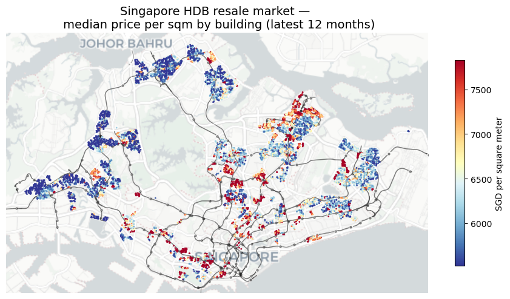

*Median price per square meter by building (last 12 months). Highest values cluster in central, mature estates and along well-connected transit corridors.*

### 2. Median PSF (price per square foot) per Building in Y2026
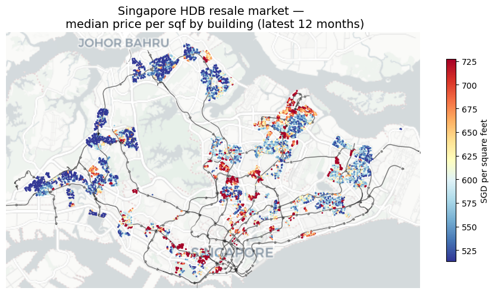

*Median price per square foot by building (last 12 months). The same premium geography appears when prices are measured in psf rather than psm.*

### 3. 5 Year % Growth in Median PSF (Y2026 vs Y2021)
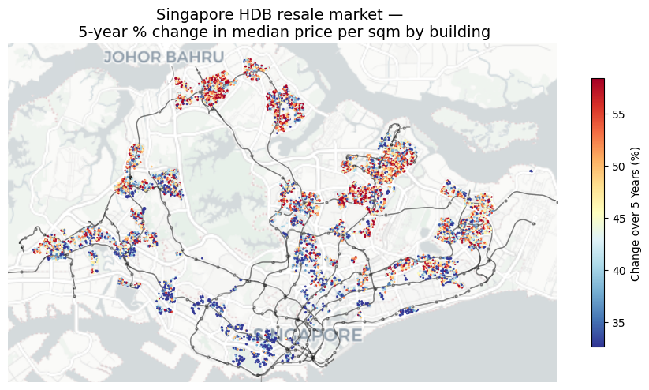

*Five-year percentage change in median price per square meter by building. Strong appreciation is visible beyond the most expensive core, indicating broad-based market growth with standout growth pockets.*

## Main results and conclusions from `resale_trends`

### Result 1: central and mature estates retain a strong price premium
The highest current price bands cluster around central Singapore and well-established estates. This implies that proximity to economic centers, amenities, and longstanding urban desirability still anchor the top of the market.

### Result 2: the strongest growth is broader than the premium core
The five-year growth map shows that appreciation is not confined to the most expensive locations. This matters because it separates **"where value is already highest"** from **"where momentum is strongest."** In fact, areas such as Woodlands, Yishun, Sengkang, and Punggol have seen very strong price appreciation.

### Result 3: rail accessibility provides strong spatial context
Overlaying MRT/LRT lines and stations helps explain why some corridors support stronger price levels and resilience. The notebook does not claim that MRT proximity is the only causal factor, but the visual alignment is economically plausible and analytically helpful.

### Practical conclusion
The resale market appears to have **two simultaneous layers**:

- a **structural premium layer** driven by centrality, maturity, and transit access
- a **growth layer** where selected outer/mid-market neighborhoods are catching up faster

That is a more nuanced conclusion than simply saying “central locations are expensive.” **An intelligent buyer should look at areas that combine affordability (yellow and blue areas in Figure 1 and Figure 2) with good price appreciation potential (yellow and red areas in Figure 3).**

## Interactive maps from the trends report

The original HTML report contains two interactive maps, extracted here as standalone files so you can open and use them immediately:

- [Open interactive maps (Open New Window)](https://tiny.cc/many/sg-hdb-analysis)

You can also open the full original report directly:

- [Open full trends report](singapore_hdb_resale_trends.html)

---

# Part II — `resale_prediction`: supervised machine-learning price prediction

## Main approach

This notebook treats the problem as a **supervised regression task** whose goal is to predict **`resale_price`** from structural, temporal, lease, and location-based features.

The workflow is:

1. Import and clean resale data
2. Reuse geocoded building coordinates
3. Engineer predictive features
4. Split into train / validation / test sets
5. Build comparable preprocessing pipelines
6. Train multiple model families
7. Compare metrics
8. Visualize predictions
9. Interpret the best models using feature importance and SHAP
10. Reconnect the predictions back to geography

## Why this method is useful

Housing prices are driven by **non-linear interactions**:

- floor area does not scale linearly with value in every town
- lease decay matters, but not uniformly across flat types and locations
- the same structural unit can sell differently depending on exact position and timing

That makes a multi-model comparison especially valuable.

## Data and feature-engineering observations

From the descriptive tables in the report:

- There are **226,916 records** in the modeling dataset.
- Median resale price is about **495,888 SGD**.
- Median floor area is about **93 sqm**.
- The most common flat type is **4 ROOM**.
- The report engineers useful predictors such as:
  - remaining lease in months
  - property age at sale
  - lease balance in years
  - storey midpoint
  - sale year / quarter / month
  - latitude / longitude
  - price per sqm
  - log resale price

These are sensible because they convert raw administrative fields into model-ready economic variables.

## Core model comparison table

| Model                 |   RMSE |   MAE |     R2 |   MAPE_pct |   Fit_seconds | Notes                          |
|:----------------------|-------:|------:|-------:|-----------:|--------------:|:-------------------------------|
| LightGBM              |  26247 | 18695 | 0.9803 |       3.66 |         10.85 | nan                            |
| XGBoost               |  30784 | 22456 | 0.9729 |       4.4  |          6.22 | nan                            |
| Random Forest         |  34049 | 23763 | 0.9669 |       4.56 |         51.29 | trained on 60,000 sampled rows |
| k-Nearest Neighbors   |  36478 | 25958 | 0.962  |       5.03 |          1.14 | nan                            |
| Neural Network (MLP)  |  36845 | 26403 | 0.9612 |       5.13 |         39.89 | trained on 40,000 sampled rows |
| Polynomial Regression |  43294 | 32465 | 0.9464 |       6.53 |         47.36 | nan                            |
| Linear Regression     |  54747 | 41277 | 0.9144 |       8.64 |          6.23 | nan                            |

## What this table says

### Best overall model: LightGBM
- **RMSE:** 26,247
- **MAE:** 18,695
- **R²:** 0.9803
- **MAPE:** 3.66%

### Strong runner-up: XGBoost
- **RMSE:** 30,784
- **MAE:** 22,456
- **R²:** 0.9729
- **MAPE:** 4.40%

### Practical interpretation
- Tree boosting dominates the leaderboard.
- Random Forest and kNN still perform well, but they trail the boosted models.
- The neural network is respectable but not best-in-class here.
- Linear and polynomial regression clearly underperform, which is exactly what we would expect in a market with complex non-linear structure.

## Best hyperparameter search tables retained from the report

### Top Random Forest runs
|   n_estimators |   min_samples_split |   min_samples_leaf | max_features   |   max_depth |   RMSE |   MAE |     R2 |   MAPE_pct |
|---------------:|--------------------:|-------------------:|:---------------|------------:|-------:|------:|-------:|-----------:|
|            100 |                   5 |                  2 | 0.5            |          20 |  39202 | 26807 | 0.9567 |       5.09 |
|            140 |                   5 |                  4 | 0.5            |          28 |  40998 | 27819 | 0.9526 |       5.26 |
|            140 |                   2 |                  1 | 0.5            |          14 |  42818 | 30425 | 0.9483 |       5.83 |
|            100 |                   2 |                  1 | sqrt           |          28 |  48056 | 34465 | 0.9349 |       6.73 |
|            100 |                   2 |                  1 | sqrt           |          20 |  62416 | 46306 | 0.8902 |       9.24 |

### Top XGBoost runs
|   subsample |   n_estimators |   max_depth |   learning_rate |   colsample_bytree |   RMSE |   MAE |     R2 |   MAPE_pct |
|------------:|---------------:|------------:|----------------:|-------------------:|-------:|------:|-------:|-----------:|
|         0.7 |            500 |           6 |            0.1  |                0.8 |  31266 | 22703 | 0.9724 |       4.45 |
|         0.8 |            300 |           8 |            0.1  |                1   |  31289 | 22537 | 0.9724 |       4.39 |
|         0.8 |            500 |           6 |            0.1  |                1   |  31656 | 22968 | 0.9718 |       4.5  |
|         1   |            500 |           6 |            0.1  |                0.8 |  31725 | 22963 | 0.9716 |       4.49 |
|         1   |            500 |           8 |            0.05 |                1   |  32082 | 23120 | 0.971  |       4.51 |

### Top LightGBM runs
|   subsample |   num_leaves |   n_estimators |   learning_rate |   colsample_bytree |   RMSE |   MAE |     R2 |   MAPE_pct |
|------------:|-------------:|---------------:|----------------:|-------------------:|-------:|------:|-------:|-----------:|
|         1   |          127 |            400 |            0.1  |                0.8 |  27660 | 19600 | 0.9784 |       3.83 |
|         0.7 |          127 |            400 |            0.1  |                0.8 |  27660 | 19600 | 0.9784 |       3.83 |
|         0.8 |          127 |            400 |            0.1  |                1   |  27850 | 19723 | 0.9781 |       3.84 |
|         0.8 |           63 |            600 |            0.1  |                1   |  27889 | 19885 | 0.9781 |       3.89 |
|         1   |          127 |            600 |            0.05 |                1   |  27909 | 19784 | 0.978  |       3.86 |

These search tables make the report stronger because they show that the final conclusion is not based on a single lucky run.

## Top features from the best model

| feature                     |   importance |
|:----------------------------|-------------:|
| num__remaining_lease_months |         5853 |
| num__floor_area_sqm         |         5682 |
| num__latitude               |         5577 |
| num__longitude              |         4910 |
| num__sale_year              |         3017 |
| num__storey_mid             |         2751 |
| num__lease_commence_date    |         2394 |
| num__sale_month_num         |         2323 |
| num__property_age_at_sale   |         1276 |
| num__lease_balance_years    |         1055 |
| cat__flat_type_4 ROOM       |          511 |
| cat__flat_type_5 ROOM       |          381 |

**Interpretation**

The top variables are economically sensible:

1. **Remaining lease months** — lease decay matters directly in Singapore resale housing.
2. **Floor area** — larger units command systematically higher prices.
3. **Latitude / longitude** — precise location adds more information than broad town labels alone.
4. **Sale year** — there is a market-wide time trend that the model captures.
5. **Storey and flat type variables** — building characteristics still matter after controlling for location.

This is a strong sign that the model is learning real housing logic rather than arbitrary noise.

## Figures from the prediction report

### 1. Distribution of resale prices
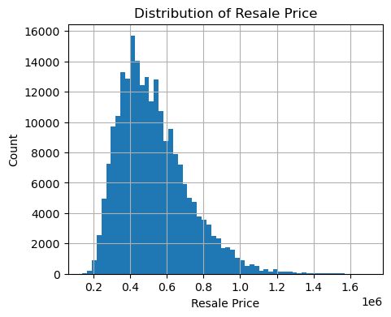

*Distribution of resale prices. The market is right-skewed: most transactions sit in the mid-range, while a smaller number of premium units create a long upper tail.*

### 2. Correlation with price per sqm and resale price
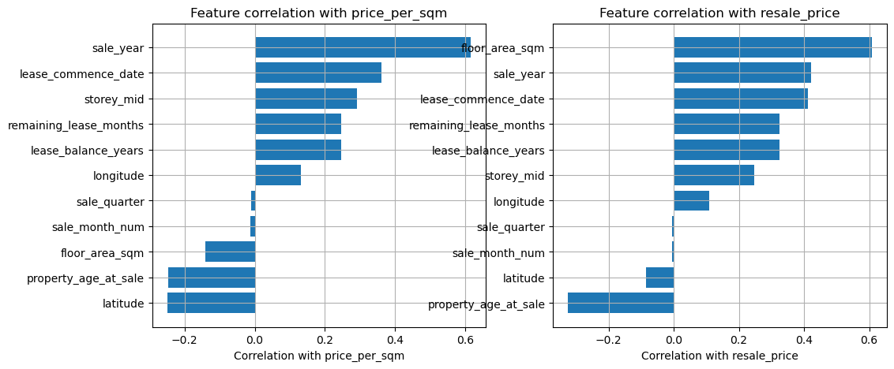

*Correlation of engineered features with price per sqm and resale price. Size, lease remaining, and precise location variables show strong predictive signal.*

### 3. Model comparison by RMSE
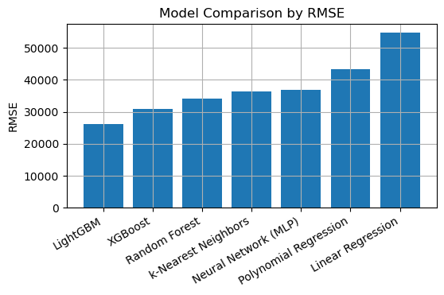

*Model comparison by RMSE. Lower is better: gradient-boosted tree models outperform simpler baselines.*

### 4. Model comparison by R²

*Model comparison by R². LightGBM and XGBoost explain the highest share of variance in resale prices.*

### 5. Actual vs predicted plots
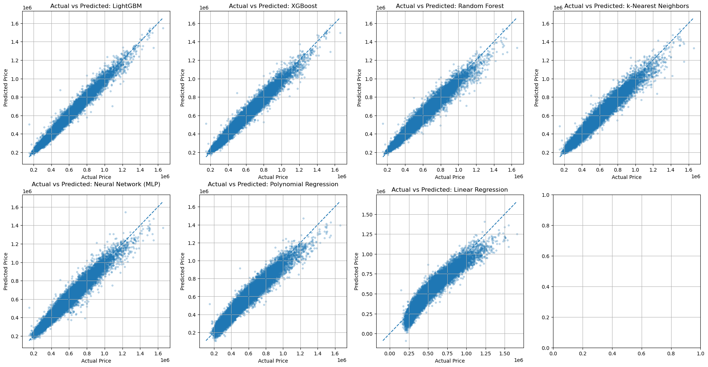

*Actual-versus-predicted plots across model families. The best models track the diagonal closely, indicating strong calibration over most of the price range.*

### 6. Top feature importances (LightGBM)
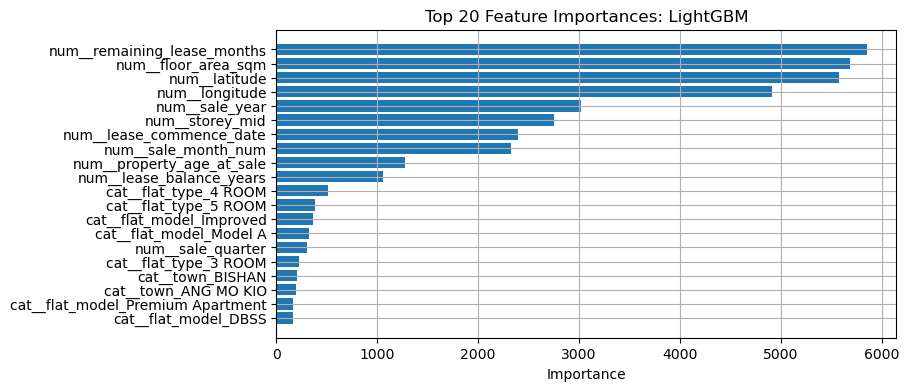

*Top LightGBM feature importances. Remaining lease, floor area, latitude, longitude, and transaction timing dominate the model.*

### 7. SHAP summary

*SHAP summary for the best model. The same core features drive predictions, and the plot shows both direction and spread of their effects.*

### 8. Median price per sqm by building (2025)
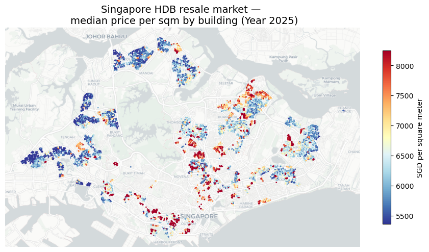

*Geospatial map of median price per square meter by building for 2025. High-price clusters persist in central and mature estates.*

### 9. Median price per psf by building (2017–2026)
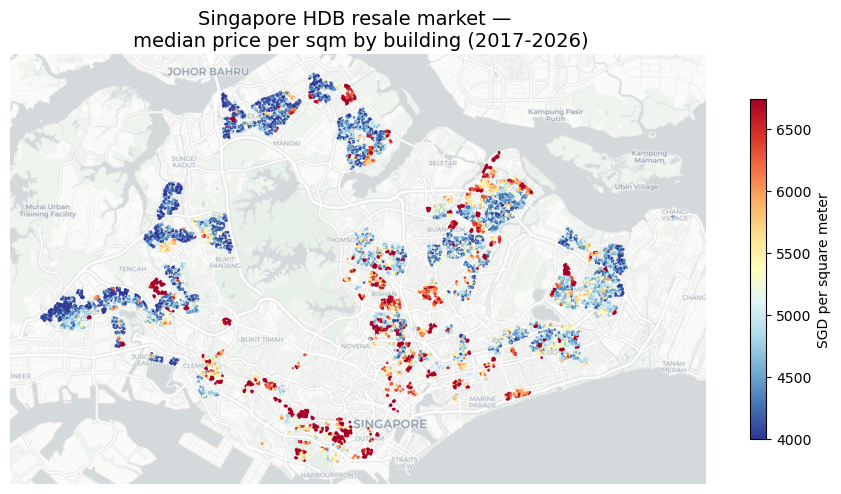

*Geospatial map of median price per square foot by building across 2017–2026. The national market remains spatially segmented, not random.*

### 10. Transaction counts by building
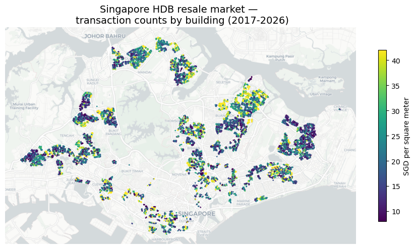

*Transaction counts by building. Trading activity concentrates in large residential clusters rather than in the highest-price locations alone.*

### 11. Median resale price by town and year

*Heatmap of median HDB resale price by town and year. Prices rose broadly over time, with central and mature towns staying at the top.*

### 12. Median resale price by town and flat type
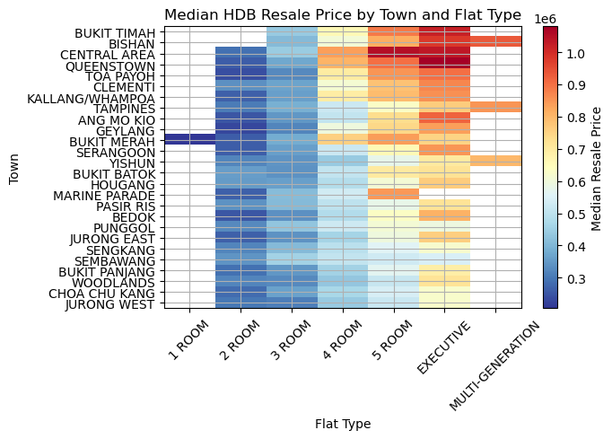

*Heatmap of median HDB resale price by town and flat type. Larger flat types usually command higher prices, but town still materially shifts the level.*

### 13. Resale transaction volume by town and year
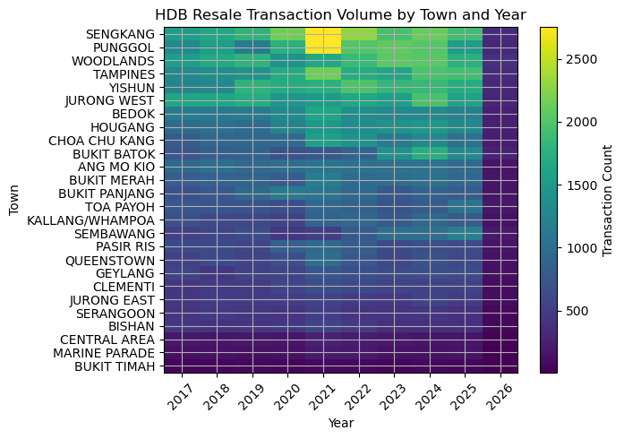

*Heatmap of HDB resale transaction volume by town and year. Volume varies across towns and over time, indicating changing liquidity and buyer interest.*

### 14. PCA projection

*PCA projection of the HDB dataset. The market shows structure, but the separation is not fully linear.*

### 15. t-SNE projection

*t-SNE projection of the HDB dataset. Non-linear embedding reveals clusters that support the use of flexible non-linear models.*

### 16. UMAP projection
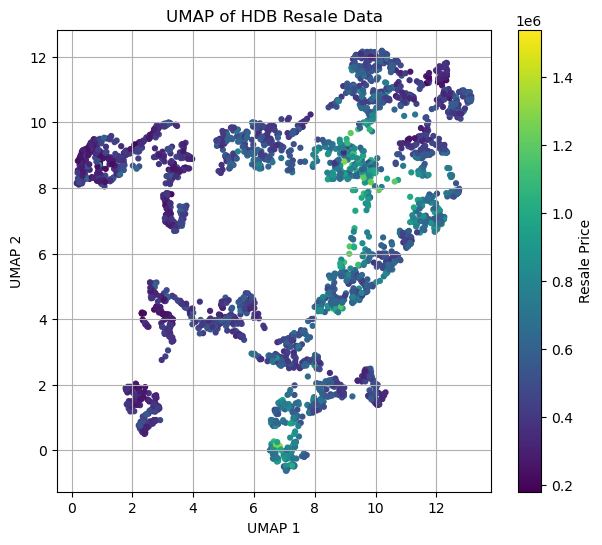

*UMAP projection of the HDB dataset. The data manifold contains structured neighborhoods rather than a single homogeneous cloud.*

## Main results and conclusions from `resale_prediction`

### Result 1: boosted tree models are the right tool for this dataset
The jump from linear models to LightGBM/XGBoost is large enough that the underlying market structure is clearly non-linear. This is not a small optimization gain; it is a modeling strategy gain.

### Result 2: location and lease dominate
The best model’s feature rankings show that **remaining lease**, **floor area**, and **latitude/longitude** carry the most signal. That is a strong real-estate conclusion, not just a machine-learning one.

### Result 3: the model is accurate enough to be practically meaningful
A MAPE around **3.66%** is strong for a nationwide resale housing problem with many neighborhoods and property subtypes. It suggests the model captures the bulk of the market structure.

### Result 4: spatial visuals and model interpretation agree
The geospatial maps, heatmaps, feature importance, and SHAP results point in the same direction:
- centrality and exact location matter
- lease and size matter
- market timing matters
- the housing market is structured rather than random

### Practical conclusion
The prediction notebook does more than produce a good score. It builds a coherent argument that **Singapore HDB resale prices are explainable through a combination of structural housing features, lease mechanics, market timing, and exact geography**, and that **boosted tree models capture that structure best**.

## Open the full original prediction report

- [Open full prediction report](singapore_hdb_resale_prediction.html)

---

# Final synthesis across both HTML reports

Taken together, the two notebooks tell a consistent story:

1. **The market has strong spatial structure.**
2. **Transit-connected mature areas remain premium.**
3. **Some outer and mid-market areas are appreciating faster than the premium core.**
4. **Exact location, lease remaining, and unit size are the dominant predictive ingredients.**
5. **LightGBM is the best final model in this project and provides both high accuracy and interpretable feature rankings.**

That combination makes this portfolio stronger than a generic machine-learning exercise: it links **geospatial market understanding** with **predictive modeling** and reaches conclusions that are both analytically grounded and economically interpretable.
