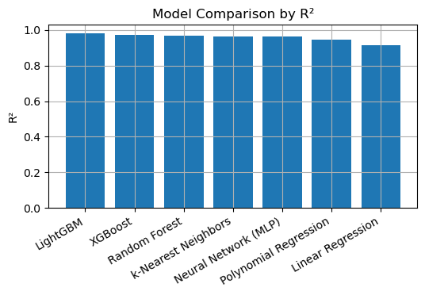
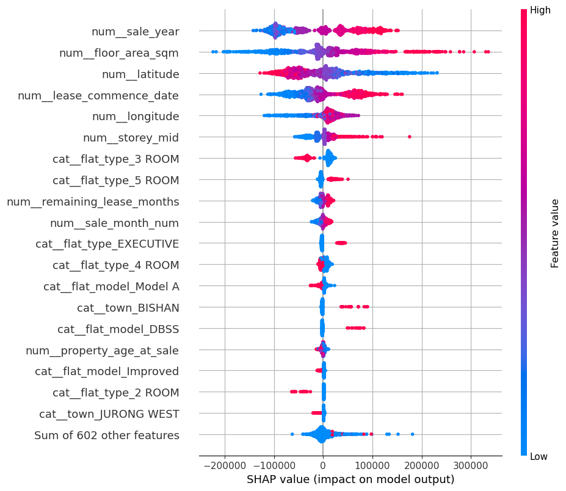
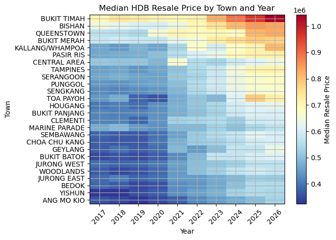
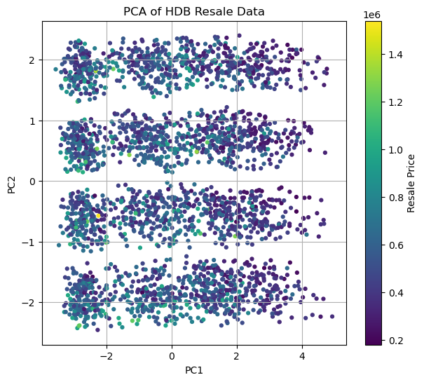
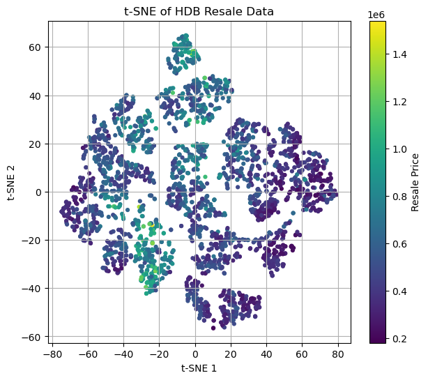

# Singapore HDB Resale Analysis Report

We all know that for the HDB flats in Singapore, certain areas are more expensive, while other areas are more affordable. For many people, the most important question is: given my budget, what can I afford?

**However, as smart consumers, we want to get the best value for our money and go on a bargain hunt. For example:**  
**- I would prefer newer flats (fewer maintenance issues)**  
**- I want a location that is affordable but also have good price appreciation potential over the long run.**  
**- I want a location that I have the bargaining power, e.g. I want the sellers to chase after me, so that I get to pick and choose and negotiate hard.**  
**- I want to find out how much the previous owner paid for his/her flat, so that I know how much room I can negotiate down.**  
**- And then finally, given my budget, what can I afford while also meeting all the conditions above?**  

Interested to find out more? Hopefully this analysis can help!

This repository-style report summarizes **two completed analysis outputs**:

1. **Part 1 — `singapore_hdb_resale_trends.html`**
2. **Part 2 — `singapore_hdb_resale_prediction.html`**

Try the interactive maps now:
[Interactive Maps (Open New Window)](https://tiny.cc/many/sg-hdb-analysis)

The order matters. The first report builds the geospatial understanding of the HDB resale market, while the second report uses that structure to test whether resale prices can be predicted accurately enough to support a practical selling-price estimate.

## How to use this report

- Read **Part 1** first to understand market structure, spatial clustering, and recent appreciation patterns.
- Then read **Part 2** to see how those patterns are converted into features for machine learning.
- At the end of Part 1, open the two interactive maps: 
  - [Interactive map: latest median price per sqm by building](outputs/sg_hdb_psm_interactive.html)
  - [Interactive map: 5-year % change in median price per sqm by building](outputs/sg_hdb_5y_change_interactive.html)
- The original exported notebook reports are also included:
  - [Full trends HTML report](singapore_hdb_resale_visualization.html)
  - [Full prediction HTML report](singapore_hdb_resale_prediction.html)

---

# Part 1 — Resale Visualization / Geospatial Trend Analysis

## Objective

This notebook turns raw HDB resale transactions into a **building-level spatial market map**. Instead of looking at thousands of repeated transactions in a flat table, it asks:

- Where are current resale prices highest?
- Which buildings have appreciated the most over the last five years?
- How are price levels distributed across Singapore?
- How does public transport context help explain the pattern?

## Main approach

The analysis follows a clear pipeline:

1. Load the official HDB resale transaction file.
2. Clean and standardize key columns.
3. Construct building addresses and geocode them with OneMap.
4. Merge transactions with usable coordinates.
5. Aggregate to the **building** level instead of the transaction level.
6. Compute:
   - recent median price per square metre (`current_psm`)
   - recent median price per square foot (`current_psf`)
   - 5-year percentage change in price
7. Overlay MRT/LRT rail lines and stations.
8. Produce both **static map figures** and **interactive HTML maps**.

This is a strong design choice because it reduces noise from individual transactions and turns the data into something a human can reason about spatially.

## Data processing and aggregation logic

A few modeling-relevant decisions are especially important here:

- **Building-level median pricing** is more stable than using a single transaction.
- The notebook compares a **recent window** against a **base window** to calculate appreciation.
- Geocoding quality is explicitly checked, and unusable records are dropped before mapping.
- Nearby MRT/LRT context is added to make the maps more interpretable.

That means this notebook is not just a visualization exercise; it is also producing a high-quality spatial feature layer that becomes useful in Part 2.

## Quick data-quality and summary findings

The final summary tables show:

- **7,949 buildings** had usable recent price-per-sqm estimates.
- **6,394 buildings** had enough historical coverage to compute a 5-year percentage change.
- The **median current price** is about **6,263.74 SGD per sqm**.
- The **2nd to 98th percentile range** for current price per sqm is about **4,869 to 10,946 SGD per sqm**.
- The **median 5-year change** is about **45.74%**, with most buildings in the roughly **18.9% to 72.6%** range.

These are very useful summary numbers because they show that:
- resale prices rose strongly over the period,
- appreciation was broad-based rather than limited to a few isolated buildings,
- but the spatial spread is still very wide.

## Key results and interpretation

### 1. Current price levels are strongly spatially clustered

The latest building-level price map shows a clear concentration of higher-value buildings in more central and better-connected parts of Singapore, while cheaper buildings are more common in outer areas.

**Interpretation**

This is the clearest visual proof that HDB resale prices are not random. They reflect a combination of:
- centrality,
- accessibility,
- town-level desirability,
- remaining lease,
- and local housing stock characteristics.

This matters because it immediately tells us that **location features should be highly predictive** in the pricing model later.

### 2. 5-year appreciation is substantial but uneven

The 5-year change map shows widespread positive growth, but not uniform growth. Some clusters rose much faster than others.

**Interpretation**

This map is more interesting than the price-level map because it separates **expensive** from **fast-growing**. A building can still be relatively affordable while having experienced very strong growth.

That distinction matters for two reasons:

1. A seller cares about both **current value** and **recent momentum**.
2. A model should not confuse “high price today” with “fast appreciation over time.”

### 3. Highest current prices are dominated by Central Area addresses

The top-ranked buildings by current price per sqm are concentrated at addresses such as:

- 1B Cantonment Rd
- 1D Cantonment Rd
- 1C Cantonment Rd
- 1A Cantonment Rd

All of these appear in **Central Area**, with current prices around **14.7k–14.95k SGD per sqm**.

**Interpretation**

This is consistent with a premium for very central HDB stock. It also suggests that the resale market contains a small set of buildings operating near the top end of the public-housing price spectrum. For a seller, this means comparing against the whole island can be misleading; pricing must be localized.

### 4. Some of the strongest 5-year gainers are outside the most expensive core

Among the strongest percentage gainers are buildings such as:

- 605 Ang Mo Kio Ave 5 (**+112.61%**)
- 129 Marsiling Rise (**+103.86%**)
- 522 Woodlands Dr 14 (**+95.56%**)
- 937 Hougang St 92 (**+95.40%**)

**Interpretation**

This is a very important market insight. The biggest growers are not simply the same as the highest-priced buildings. That implies:
- there are catch-up dynamics across towns,
- growth can be driven by transport upgrades, estate maturity, or changing demand,
- and a predictive model should capture **non-linear interactions**, not just a “central = expensive” rule.

### 5. MRT/LRT context helps explain the map patterns

The notebook overlays rail lines and stations and also computes nearest-station distances. For the top Cantonment Road buildings, the nearest station is **Outram Park**, with distances of roughly **276 m to 393 m**.

**Interpretation**

The rail overlay makes the market structure easier to explain. It does not prove that distance to MRT alone determines value, but it strongly supports the idea that accessibility is one of the main drivers of resale price differences.

## Main conclusions from Part 1

1. The HDB resale market shows **strong spatial structure**.
2. Building-level median prices are a much better analytical unit than raw transactions.
3. Price levels and appreciation rates are related but not identical.
4. Central locations command a clear premium.
5. Some outer-town buildings have experienced extremely strong growth.
6. Rail accessibility is visually and analytically relevant.
7. The output of this notebook is exactly the kind of structured, geocoded data that should improve prediction performance in Part 2.

## Interactive maps

These are the most useful end-user assets from the visualization notebook.

### Latest median price per sqm by building
Open here: [resale_trends_current_price_map.html](outputs/sg_hdb_psm_interactive.html)

### 5-year percentage change in median price per sqm by building
Open here: [resale_trends_5y_change_map.html](outputs/sg_hdb_5y_change_interactive.html)

These maps let the reader:
- zoom into specific estates,
- hover over buildings,
- inspect local values directly,
- and compare spatial clusters interactively.

---

# Part 2 — Resale Prediction / Machine Learning

## Objective

The second notebook asks the practical question:

> **Can HDB resale prices be predicted accurately enough to estimate a reasonable selling price for a flat today?**

This is the most decision-oriented part of the project. The goal is not just to build a model with a good score, but to build one that is plausible for **real-world pricing support**.

## Main approach

The notebook uses a full supervised learning workflow:

1. Load cleaned transaction data.
2. Reuse geocoded location information from Part 1.
3. Engineer time, lease, storey, and location features.
4. Split the data into train / validation / test sets.
5. Build comparable preprocessing pipelines.
6. Fit several model families.
7. Compare them on held-out performance.
8. Visualize prediction quality.
9. Interpret the best model with feature importance and SHAP.
10. Reconnect model results back to geospatial structure with maps and heatmaps.

## Why this design is strong

This is a good modeling design because it does not jump straight to a single algorithm. It compares:

- Linear Regression
- Polynomial Regression
- Random Forest
- k-Nearest Neighbors
- Neural Network (MLP)
- XGBoost
- LightGBM

That gives both a **practical answer** and a **learning answer**:
- which model performs best,
- and what that says about the shape of the pricing problem.

## Dataset and feature picture

The cleaned modeling dataset contains **226,916 rows**. The descriptive tables show:

- mean resale price around **527k SGD**
- median resale price around **495,888 SGD**
- median floor area around **93 sqm**
- resale prices extending up to **1.7M SGD**

The feature engineering section adds useful predictive variables such as:

- sale year / month / quarter
- remaining lease in months
- property age at sale
- lease balance in years
- storey midpoint
- latitude / longitude
- town, flat type, flat model, and street name

This is exactly the kind of feature set you would want if the end goal is pricing a flat today: it combines structure, timing, and location.

## Distribution and feature correlation

The notebook first visualizes the resale price distribution and feature correlations.

**Interpretation**

The resale price distribution is right-skewed, which is typical for housing markets. That is a good reason to expect non-linear models to outperform simple linear ones.

The correlation charts also show that no single variable explains the whole market. Price is shaped by a combination of:
- area,
- lease,
- time,
- and geography.

That again suggests that flexible, interaction-aware models should win.

## Model performance summary

This is the most important table in the entire report.

| Model | RMSE | MAE | R² | MAPE |
|---|---:|---:|---:|---:|
| LightGBM | 26,246.69 | 18,695.17 | 0.9803 | 3.66% |
| XGBoost | 30,784.22 | 22,455.96 | 0.9729 | 4.40% |
| Random Forest | 34,048.66 | 23,763.17 | 0.9669 | 4.56% |
| k-Nearest Neighbors | 36,477.59 | 25,958.09 | 0.9620 | 5.03% |
| Neural Network (MLP) | 36,844.99 | 26,403.34 | 0.9612 | 5.13% |
| Polynomial Regression | 43,293.53 | 32,465.41 | 0.9464 | 6.53% |
| Linear Regression | 54,747.33 | 41,276.82 | 0.9144 | 8.64% |

## What this means

### LightGBM is the clear winner

LightGBM is the best overall model in this notebook. Its performance is strong on every major metric:

- lowest RMSE
- lowest MAE
- highest R²
- lowest MAPE

A **MAPE of about 3.66%** is especially meaningful for the real use case. It suggests that, on average, the model’s error is only a few percent of the transaction price.

For a flat worth around **500,000 SGD**, that implies a typical absolute error on the order of roughly **18k–26k SGD**, depending on which metric you use.

That is not perfect, but it is absolutely useful as a **market-pricing support tool**.

### Tree boosting beats simpler models decisively

XGBoost is also very strong, but LightGBM is better. Random Forest performs well, but it trails the boosting models. Linear and polynomial regression are clearly weaker.

**Interpretation**

This strongly suggests that HDB resale pricing is:
- non-linear,
- interaction-heavy,
- and not well described by one global linear formula.

That conclusion is consistent with Part 1, where geography, estate type, and appreciation patterns clearly varied across the island.

## Actual vs predicted performance

The actual-vs-predicted grid shows that the best models track the diagonal tightly, especially the tree-based models.

**Interpretation**

This is reassuring because it shows the good scores are not just statistical artifacts. The models really are reproducing the observed price structure quite closely. Errors appear larger mainly at the extreme ends of the market, which is normal in housing datasets.

## Model interpretation: what drives predicted price?

The LightGBM feature-importance chart and SHAP summary are among the most valuable outputs in the notebook.

The most important features include:

1. remaining lease months
2. floor area
3. latitude
4. longitude
5. sale year

**Interpretation**

This is exactly what a domain expert would expect:

- **Remaining lease** matters because lease decay affects value.
- **Floor area** matters because size still anchors price.
- **Latitude/longitude** matter because micro-location matters.
- **Sale year** matters because the market itself moved upward over time.

The SHAP view adds an important nuance: these variables do not just matter individually; they matter in different directions and magnitudes across different flats. In other words, the pricing logic is conditional and interactive, not one-size-fits-all.

## Spatial and market structure views inside the prediction notebook

The notebook returns to maps and heatmaps to keep the modeling grounded in real market structure.

### Spatial price maps

### Town and flat-type heatmaps

**Interpretation**

These plots are valuable because they show the model is solving a real structured problem:

- Some towns are persistently more expensive than others.
- Larger flat types sit at higher price bands.
- Transaction volume is uneven across towns and years.
- Spatial clusters seen in Part 1 are still visible here.

This supports the conclusion that the model is learning genuine market structure, not noise.

## Dimension reduction views

The notebook ends with PCA, t-SNE, and UMAP projections.

These are exploratory rather than predictive, but they are useful for intuition:
- the data is not arranged as one simple cloud,
- there are substructures and clusters,
- and that again helps explain why flexible non-linear models do best.

---

# Practical answer to the seller’s question

## Can this project estimate a reasonable selling price for your own flat today?

**Yes — with an important caveat.**

The best model in the notebook appears accurate enough to provide a **reasonable market estimate** for an HDB flat, especially as a decision-support benchmark rather than a final listing price.

## Why the answer is yes

Because the winning model:
- uses both structural and spatial features,
- generalizes very well on held-out data,
- achieves **R² ≈ 0.98**,
- and keeps average percentage error to around **3.66%**.

That is strong enough to support practical use cases such as:
- estimating a fair asking-price range,
- checking whether an agent’s suggested listing price is realistic,
- comparing your flat against recent market structure,
- and identifying whether your flat looks overpriced or underpriced relative to similar historical sales.

## Important caveats

Even a strong model should be treated as an estimate, not ground truth. Real sale price can still be affected by factors not fully captured here, such as:

- renovation quality and interior condition
- exact block facing / view / noise exposure
- unusual urgency by buyer or seller
- very recent micro-market shifts
- rare or thinly traded building segments

So the best practical use is:

> **Use the model as a data-driven anchor, then adjust using current comparables and property-specific judgment.**

---

# Final conclusions

## Part 1 conclusion

The visualization notebook shows that the Singapore HDB resale market has a clear and meaningful geospatial structure. Prices cluster strongly by location, accessibility, and town. Appreciation over five years is broad but uneven. Building-level aggregation and rail overlays make the market much easier to interpret.

## Part 2 conclusion

The prediction notebook shows that HDB resale prices can be modeled very accurately with modern tree-boosting methods. Among all tested approaches, **LightGBM** performs best and is strong enough to support real-world price estimation.

## Combined project conclusion

Taken together, the two notebooks form a coherent analytical story:

1. First, map and understand the market spatially.
2. Then convert those patterns into predictive features.
3. Use the best-performing model to estimate a reasonable current market price.

That makes this project more than an academic exercise. It is a practical framework for answering a real homeowner question:

> **“If I sold my HDB flat today, what is a reasonable market price?”**

The evidence from this project suggests that the answer can be estimated quite well — especially when geospatial context, lease characteristics, property size, and recent market timing are all included together.
