# Singapore HDB Resale Analysis Report

## Why this analysis exists

We all know that for HDB flats in Singapore, certain areas are more expensive while other areas are more affordable. For many people, the most important practical question is simple: **given my budget, what can I actually afford?**

But a smart buyer usually wants more than just “the cheapest flat available.” A real bargain hunt asks harder questions:

- Can I find a **newer flat** with fewer maintenance issues?
- Can I buy in a place that is still **affordable today** but has **good price appreciation potential** over the long run?
- Can I focus on locations where I may have more **bargaining power**, instead of competing in the hottest micro-markets?
- Can I estimate what the previous owner likely paid, so I understand how much room there may be to negotiate?
- And finally, given my budget, **what can I afford while also meeting all of the conditions above?**

This project is designed to answer those questions in a practical, data-driven way.

You can try out right now:  
- [Interactive Map (open new window)](https://tiny.cc/many/sg-hdb-analysis)

---

## What is included in this report

This report summarizes two analysis notebooks exported as HTML:

1. **`resale_visualization`** — market structure, affordability, capital-gain potential, market activity, age, building form, and interactive maps.
2. **`resale_prediction`** — feature engineering, model comparison, prediction performance, and interpretation of what drives resale prices.

The goal is not just to display charts, but to tell a useful buyer-side story:

- where prices are high,
- where prices are rising,
- where trading activity is deep or thin,
- what kinds of structural trade-offs exist,
- and which modeling approach best predicts resale prices.

---

## How to use the interactive files

This markdown file is meant to be directly usable. All static figures used in the report are embedded below.

For the **interactive maps**, open the HTML file below and scroll to section **“6B) Generate interactive maps”**:

- [Open the visualization notebook with the two interactive maps](./singapore_hdb_resale_visualization.html)
- [Open the prediction notebook HTML](./singapore_hdb_resale_prediction.html)

These HTML files are included in the same package so the reader can zoom, pan, and hover over buildings directly.

---

# Part I — `resale_visualization`

## Main approach

The visualization notebook builds a **decision-oriented view of the HDB resale market** at the building level.

Instead of stopping at town-wide averages, it merges resale transactions with the HDB residential buildings master list and geospatial coordinates, then creates building-level metrics that a real buyer can act on. The notebook emphasizes five practical lenses:

1. **Affordability** — current price per square meter.
2. **Capital gain potential** — recent percentage growth in price per square meter.
3. **Market activity** — number of transactions, which indicates how deep and competitive a micro-market is.
4. **Age** — proxy for lease decay, maintenance burden, and redevelopment-era differences.
5. **Height / urban form** — helps interpret density and estate form.

It also overlays **MRT/LRT lines** so that pricing and growth can be read against transport access rather than on a blank map.

## Method summary

The notebook follows this workflow:

1. Load and clean HDB resale transaction data.
2. Merge transactions with the HDB buildings master list and geocodes.
3. Convert raw tables into geospatial objects.
4. Aggregate transactions to the **building level**.
5. Compute rolling-window metrics, especially:
   - current median PSM,
   - 5-year PSM growth,
   - transaction count,
   - building age,
   - total floors,
   - distance-aware rail context through mapping overlays.
6. Visualize the results both as static plots and as interactive maps.

This is a strong method for buyer research because it avoids two common mistakes:
- relying only on town averages, which hide large intra-town differences; and
- looking only at current price, which misses growth, liquidity, and structural trade-offs.

---

## Key market summary tables

### Overall pricing and growth distribution

The notebook’s summary table shows a clear spread between the cheap tail, middle market, and premium tail:

| metric                              | Bottom 1%   | Bottom 25%   | median   | Top 25%   | Top 1%   |
|:------------------------------------|:------------|:-------------|:---------|:----------|:---------|
| Price Per Square Meter (PSM): Y2026 | $4731.0     | $5750.0      | $6264.0  | $7122.0   | $11785.0 |
| % Growth in PSM: Y2022-Y2026        | 7.0%        | 23.0%        | 30.0%    | 36.0%     | 55.0%    |

### What this means

- The **bottom 1%** of building-level 2026 PSM is around **SGD 4,731/sqm**.
- The **top 1%** reaches about **SGD 11,785/sqm**.
- Over the last five years, building-level PSM growth ranges from roughly **7%** at the low end to **55%** at the high end.

That spread matters. It tells us that the HDB resale market is not one unified market. It is a collection of very different submarkets:
- premium central and city-fringe buildings,
- middle-market family estates,
- and lower-priced outer-town stock that can still post strong growth from a lower base.

---

## Top expensive buildings

The most expensive buildings are heavily concentrated in **Cantonment Road / central-city locations**, which is exactly what one would expect from rare, central, high-demand HDB stock.

| Address           | Town         |   PSM 2026 (SGD/sqm) |   5Y PSM Growth (%) |   5Y Transactions |
|:------------------|:-------------|---------------------:|--------------------:|------------------:|
| 1B CANTONMENT RD  | CENTRAL AREA |             14,947.0 |                30.5 |                41 |
| 1D CANTONMENT RD  | CENTRAL AREA |             14,940.0 |                45.3 |                31 |
| 1C CANTONMENT RD  | CENTRAL AREA |             14,759.0 |                36.7 |                61 |
| 1A CANTONMENT RD  | CENTRAL AREA |             14,717.0 |                43.2 |                39 |
| 1G CANTONMENT RD  | CENTRAL AREA |             14,587.0 |                40.4 |                53 |
| 1F CANTONMENT RD  | CENTRAL AREA |             14,177.5 |                29.6 |                41 |
| 1E CANTONMENT RD  | CENTRAL AREA |             14,108.5 |                32.7 |                40 |
| 10B BOON TIONG RD | BUKIT MERAH  |             13,678.0 |                26.8 |                36 |
| 9A BOON TIONG RD  | BUKIT MERAH  |             13,643.0 |                31.6 |                24 |
| 90 DAWSON RD      | QUEENSTOWN   |             13,399.0 |                36.8 |                32 |

### Interpretation

These buildings are expensive **and** still recorded healthy 5-year growth. That combination suggests they are not merely legacy expensive areas: they remain active, supported premium micro-markets.

However, from a bargain-hunting perspective, these are usually **not** where a buyer gets the strongest negotiating edge. Premium areas often have:
- stronger buyer competition,
- thinner room for negotiation per square meter,
- and a higher absolute dollar risk if market sentiment cools.

---

## Top capital-gain buildings

The highest-growth buildings are more geographically mixed and are not simply the same buildings that already sit at the top of the price ladder.

| Address                 | Town            |   PSM 2026 (SGD/sqm) |   5Y PSM Growth (%) |   5Y Transactions |
|:------------------------|:----------------|---------------------:|--------------------:|------------------:|
| 770 YISHUN AVE 3        | YISHUN          |              6,220.5 |                81.4 |                16 |
| 524 SERANGOON NTH AVE 4 | SERANGOON       |              6,477.5 |                80.6 |                 6 |
| 39 JLN BAHAGIA          | KALLANG/WHAMPOA |             10,528.0 |                74.4 |                 3 |
| 146 BEDOK RESERVOIR RD  | BEDOK           |              6,905.0 |                73.7 |                 8 |
| 531 HOUGANG AVE 6       | HOUGANG         |              7,034.0 |                73.7 |                 6 |
| 264B COMPASSVALE BOW    | SENGKANG        |              8,226.0 |                72.0 |                10 |
| 208 TAMPINES ST 21      | TAMPINES        |              7,105.0 |                69.2 |                 8 |
| 168 HOUGANG AVE 1       | HOUGANG         |              6,800.0 |                67.1 |                 4 |
| 329 UBI AVE 1           | GEYLANG         |              6,786.0 |                65.6 |                 5 |
| 135 BEDOK RESERVOIR RD  | BEDOK           |              7,381.0 |                65.3 |                 5 |

### Interpretation

This table is one of the most useful in the entire analysis.

It shows that **strong appreciation does not require already-premium pricing**. For example, several buildings with 2026 PSM still in the ~SGD 6,000–7,000/sqm range posted **70%+ five-year growth**.

That is the classic bargain-hunter insight:
- the most expensive building is not automatically the best investment,
- and the most affordable building is not automatically the weakest performer.

Instead, the best value often sits in the middle:
- still affordable relative to premium districts,
- but already showing evidence of re-rating.

---

## Figures and interpretation

### 1. Affordability map — current PSM by building

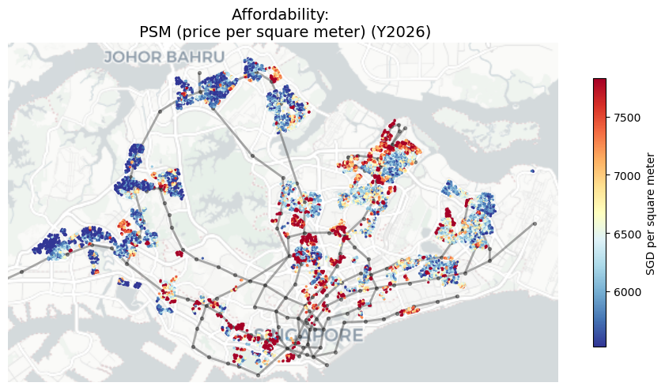

### Key takeaway

This map makes the premium spatial structure of the market obvious. The highest-price clusters are concentrated in central and city-fringe areas, while outer towns remain more affordable in level terms.

A buyer should read this as a **budget filter** first:
- if the goal is pure affordability, outer-town clusters still dominate;
- if the goal is access plus prestige plus scarcity, central clusters stay expensive for structural reasons.

### 2. Median PSM by town and year

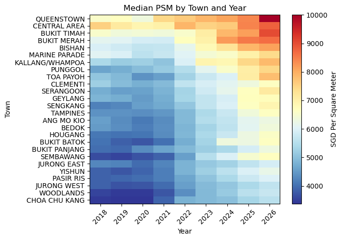

### Key takeaway

The heatmap shows a broad upward move across almost all towns by 2025–2026. But the levels are not uniform:
- mature central towns remain structurally higher,
- outer towns remain cheaper,
- and the gradient persists across years.

This suggests that market-wide inflation lifted almost everyone, but **location hierarchy still matters**. Broad cycles do not erase locational premiums.

### 3. Median resale price by town and flat type

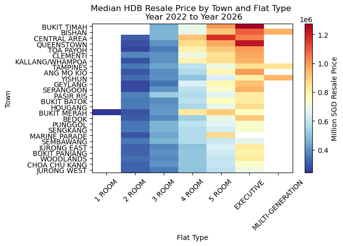

### Key takeaway

This figure shows that price is shaped by both:
- **location**, and
- **unit type / size**.

A 4-room or 5-room flat in a cheaper town can sometimes compete in absolute resale price with a smaller flat in a more central location. That matters for affordability screening. Buyers are often trading off:
- centrality,
- unit size,
- and building age.

---

### 4. Capital-gain map — 5-year PSM growth

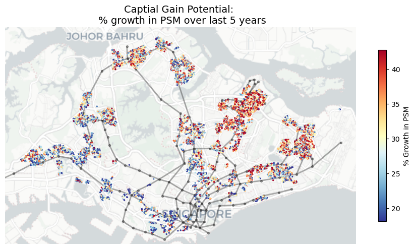

### Key takeaway

The growth leaders are more dispersed than the premium-price leaders.

That is important. It means that the strongest recent appreciation was not confined to the most expensive existing clusters. In practical terms:
- some outer or middle-market areas may still offer better upside than already-fully-priced premium locations,
- especially for buyers who care about future resale value rather than prestige alone.

This is where a patient buyer should spend time.

---

### 5. Transaction activity map — number of sales per building

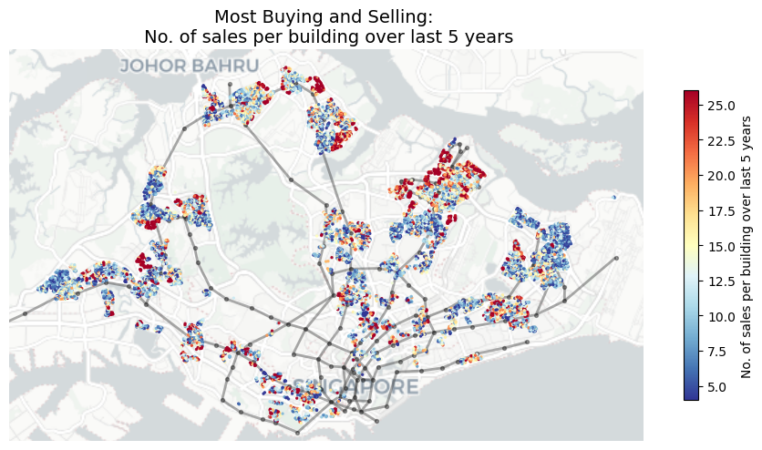

### Key takeaway

High activity tells us where the market is deep enough to generate a more reliable pricing signal. Low activity tells us where medians can look impressive but be driven by only a few transactions.

From a negotiation perspective, this map is extremely useful:
- **high-activity areas** may indicate liquid, proven demand, but also potentially more buyer competition;
- **low-activity areas** may create more uncertainty, which can either produce bargains or signal weak market depth.

A bargain hunter should prefer places where growth is attractive **and** activity is not too thin.

### 6. Transaction volume by town and year

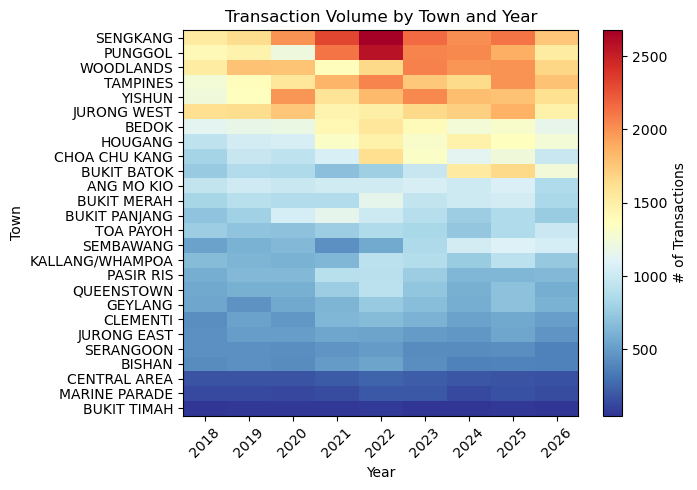

### Key takeaway

The hottest transaction volumes are concentrated in mass-market family towns such as **Sengkang, Punggol, Tampines, Yishun, Woodlands, and Bedok**. These are not the most expensive locations, but they are deep and active markets.

That supports an important conclusion:
- the premium market is not the same thing as the deepest market.
- If a buyer wants more choices, more comparables, and potentially more bargaining leverage from selection, high-volume towns can be more favorable than rare premium enclaves.

---

### 7. Age map — older vs newer buildings

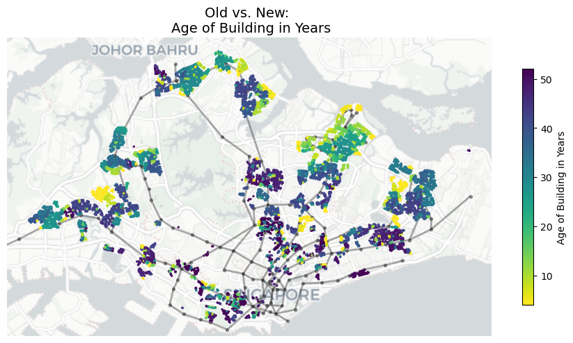

### Key takeaway

This map highlights a central HDB trade-off:
- newer flats are operationally attractive and easier to justify for maintenance and remaining lease,
- but older flats in strong locations can still command high prices.

So “buy newer” is not always the right rule. A buyer should instead ask:
- is this older flat getting discounted enough to compensate for age?
- or is the location premium so strong that I am still overpaying despite the shorter remaining lease?

This is one of the best places to combine price, growth, and age to look for value.

### 8. Height map — high-rise vs low-rise stock

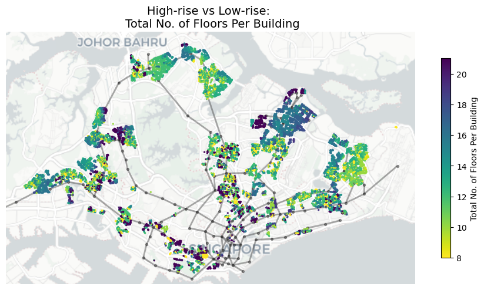

### Key takeaway

Height does not directly determine price, but it helps explain urban form. High-rise concentrations often align with denser, newer, or more intensely developed estates.

This matters because some towns are not just different in price; they are different in physical planning and stock composition. A buyer comparing estates is often comparing **housing systems**, not just individual flats.

---

## The two interactive maps

The notebook ends with two interactive maps that are particularly useful for real buyers:

1. **Interactive current PSM map**
2. **Interactive 5-year growth map**

Open them here by launching the visualization HTML and scrolling to section 6B:

- [Interactive maps in `singapore_hdb_resale_visualization.html`](./singapore_hdb_resale_visualization.html)

You can try out right now:  
- [Interactive Map (open new window)](https://tiny.cc/many/sg-hdb-analysis)

### Why these maps matter

The interactive maps allow the user to:
- zoom into specific neighborhoods,
- hover over buildings,
- inspect building attributes,
- and compare nearby clusters rather than relying on town averages.

This is exactly the kind of tool a buyer would use when narrowing a shortlist.

---

## Main conclusions from Part I

### 1. Singapore’s HDB market has a clear spatial hierarchy
Central and city-fringe areas remain persistently more expensive. This is not noise; it appears as a durable structural premium.

### 2. High price and high growth are not the same thing
Some of the strongest appreciation occurs outside the already most expensive areas. That is where value-seeking buyers should look hardest.

### 3. Market depth matters
A price signal is more trustworthy when supported by many recent transactions. Thinly traded buildings may look attractive, but the signal is noisier.

### 4. Age must be interpreted with location
Older flats are not automatically bad buys. The real question is whether the discount is large enough relative to the location advantage.

### 5. Bargain hunting should focus on “affordable + growing + liquid”
The best shortlist is usually not:
- the cheapest stock,
- nor the most expensive stock,
- but the segment where price remains reasonable, appreciation is credible, and transaction activity is healthy.

---

# Part II — `resale_prediction`

## Main approach

The second notebook answers the next practical question:

> Once we understand the market structure, can we **predict the resale price of a flat** from its observable characteristics?

The modeling notebook converts HDB resale transactions into a supervised learning problem and compares multiple regression models to see which one best predicts price.

This is highly practical because it helps a buyer or analyst answer questions like:
- Is this asking price reasonable?
- How much does size matter relative to location?
- How much is age hurting the value?
- Which combinations of features consistently push price higher or lower?

## Method summary

The notebook follows a well-structured modeling pipeline:

1. Import and clean resale data.
2. Engineer structured features from raw columns.
3. Split data into train, validation, and test sets.
4. Build reusable preprocessors and evaluation helpers.
5. Train and compare several model families:
   - Linear Regression
   - Polynomial Regression
   - Random Forest
   - k-Nearest Neighbors
   - Neural Network (MLP)
   - XGBoost
   - LightGBM
6. Evaluate models using multiple metrics:
   - RMSE
   - MAE
   - R²
   - MAPE
7. Interpret the best model using:
   - feature importance,
   - SHAP,
   - and low-dimensional visualization (PCA / t-SNE / UMAP).

This is a strong workflow because it does not jump straight to one “favorite” model. It shows both:
- baseline models for benchmarking,
- and stronger nonlinear ensemble models for final performance.

---

## Data structure and first checks

### 1. Distribution of resale price

The target variable is right-skewed, as expected. Most HDB resale transactions cluster in the middle of the market, with a long tail of premium transactions.

This is an important modeling fact:
- a skewed target means average error can be influenced by the premium tail,
- so a model should be judged with more than one metric.

### 2. Simple feature correlations

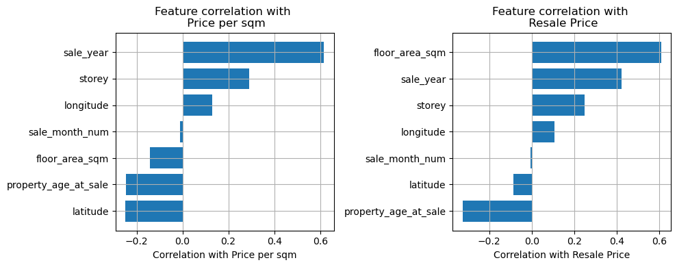

### 3. Full numeric correlation heatmap

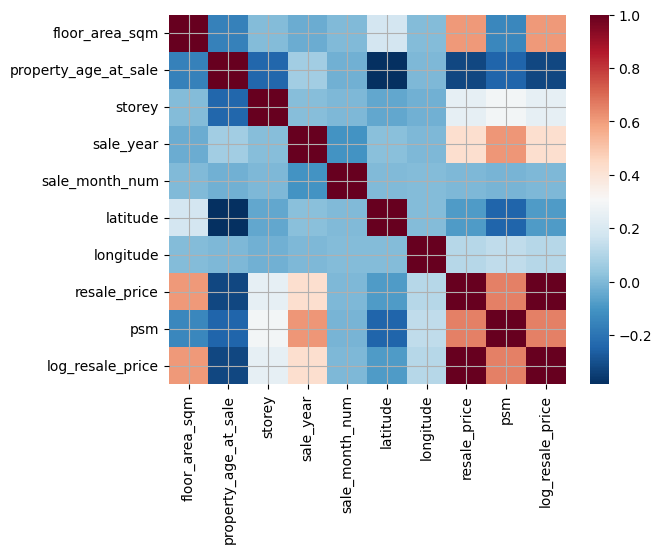

### Interpretation

These early diagnostics already show the expected market logic:
- **floor area** is strongly related to resale price,
- **latitude / longitude** matter because location matters,
- **property age** tends to drag value down,
- **time variables** matter because the market itself moves over time.

In other words, the model is being asked to learn economically sensible relationships, not arbitrary patterns.

---

## Model comparison

### Comparison table

| Model                 | RMSE      | MAE       |     R² |   MAPE (%) |   Fit Time (s) | Notes                          |
|:----------------------|:----------|:----------|-------:|-----------:|---------------:|:-------------------------------|
| LightGBM              | 26,374.95 | 18,785.39 | 0.9807 |       3.67 |           6.73 | nan                            |
| XGBoost               | 31,302.28 | 22,803.31 | 0.9728 |       4.46 |           7.11 | nan                            |
| Random Forest         | 35,118.71 | 24,328.02 | 0.9657 |       4.65 |          40.69 | trained on 60,000 sampled rows |
| k-Nearest Neighbors   | 35,337.29 | 25,091.06 | 0.9653 |       4.86 |           1.30 | nan                            |
| Neural Network (MLP)  | 41,945.56 | 30,339.88 | 0.9511 |       6.00 |          52.61 | trained on 40,000 sampled rows |
| Polynomial Regression | 43,530.76 | 32,563.05 | 0.9473 |       6.51 |          22.70 | nan                            |
| Linear Regression     | 55,038.47 | 41,589.15 | 0.9158 |       8.68 |           5.55 | nan                            |

### What stands out

- **LightGBM** is the best overall model.
- **XGBoost** is the clear runner-up.
- Tree-based ensemble methods strongly outperform linear and polynomial baselines.
- The neural network works, but does not beat the boosted-tree models here.
- Linear regression is useful as a baseline, but clearly misses too much nonlinear structure.

### Best-model interpretation

LightGBM achieves approximately:

- **RMSE:** SGD 26.4k
- **MAE:** SGD 18.8k
- **R²:** 0.9807
- **MAPE:** 3.67%

For a resale-price problem, that is excellent performance. In practical terms, the model’s typical absolute error is on the order of **under SGD 20k**, which is small relative to the overall price range of HDB resale flats.

That makes the model genuinely useful as a **pricing support tool**, even though it is still not a replacement for live listing intelligence, renovation condition, or seller urgency.

---

## Model comparison figures

### 4. RMSE comparison

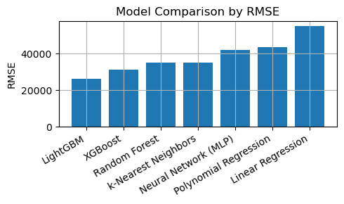

### 5. R² comparison

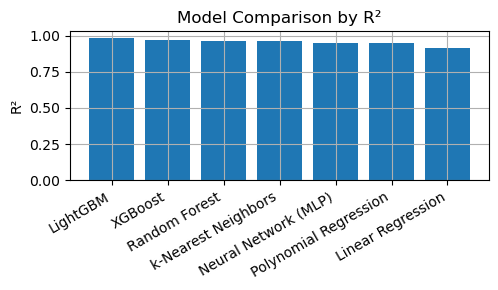

These two figures make the ranking visually obvious. LightGBM dominates on both error and explanatory power, with XGBoost following behind. The gap between boosted trees and the simpler baselines is large enough to be meaningful, not marginal.

---

## Actual vs. predicted behavior

### 6. Actual vs predicted plots across models

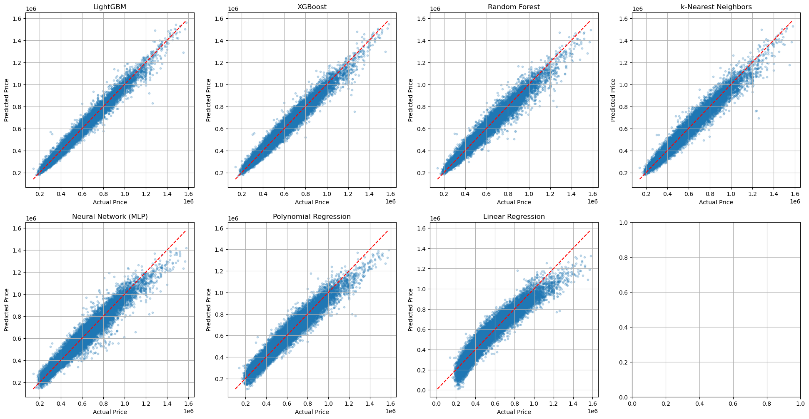

### Interpretation

The best models produce point clouds that sit tightly around the 45-degree reference line, which means they are reproducing observed prices well across much of the market.

The weaker models show more curvature, spread, or systematic bias. For a housing model, this matters because average accuracy can hide poor behavior at either the low-end or high-end tail.

The visual takeaway is consistent with the metrics:
- boosted trees capture the structure best,
- simpler models leave more systematic error on the table.

---

## What the model is learning

### 7. Top 20 feature importances from LightGBM

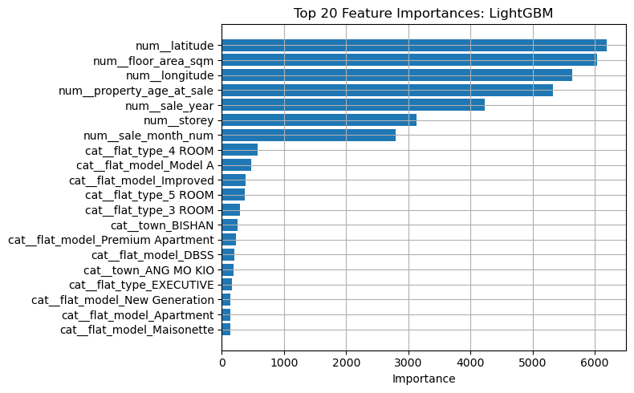

Top feature rankings:

| Feature                   |   Importance |
|:--------------------------|-------------:|
| num__latitude             |         6191 |
| num__floor_area_sqm       |         6036 |
| num__longitude            |         5636 |
| num__property_age_at_sale |         5324 |
| num__sale_year            |         4228 |
| num__storey               |         3127 |
| num__sale_month_num       |         2791 |
| cat__flat_type_4 ROOM     |          576 |
| cat__flat_model_Model A   |          475 |
| cat__flat_model_Improved  |          375 |

### Interpretation

The highest-importance features are exactly the ones a housing analyst would expect:

- **Latitude and longitude**: location is fundamental.
- **Floor area**: size strongly affects value.
- **Property age at sale**: lease decay and building vintage matter.
- **Sale year / month**: the market changes over time.
- **Storey**: vertical position contributes additional pricing signal.

This is reassuring. It suggests the model is learning meaningful housing economics, not merely exploiting statistical artifacts.

### 8. SHAP summary plot

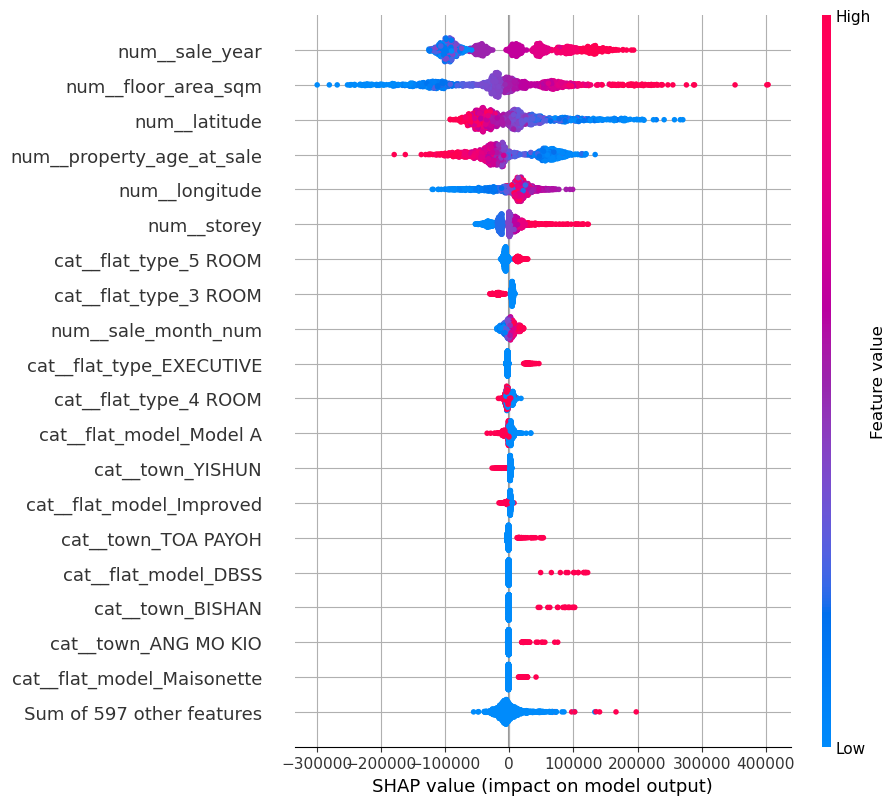

### Interpretation

The SHAP plot adds direction, not just importance.

It shows that:
- larger floor area tends to push predicted price upward,
- newer flats tend to support higher values,
- favorable locations push prices higher,
- and some flat types or models carry predictable premiums or discounts.

This is the most decision-useful interpretation layer in the notebook because it explains **why** a given flat’s predicted price is high or low.

---

## Dimension-reduction visuals

These three figures are mainly explanatory and exploratory. They are not the predictive engine, but they help show that the transformed feature space has real structure.

### 9. PCA projection

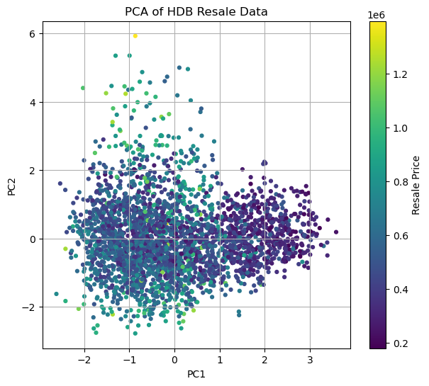

### 10. t-SNE projection

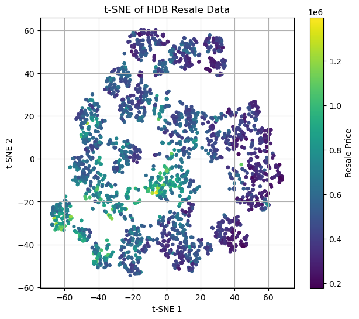

### 11. UMAP projection

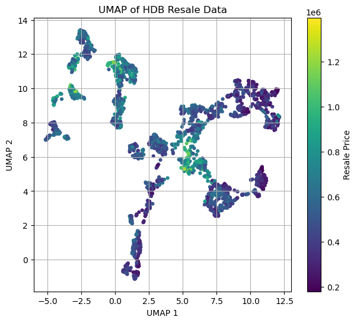

### Interpretation

The projections show that the dataset is not just random scatter. There are structured groupings in the transformed feature space, and these groups align with price gradients.

That supports the broader modeling story:
- HDB resale prices are generated by a **complex but learnable structure**,
- and nonlinear models are better suited than simple linear models to capture it.

---

## Main conclusions from Part II

### 1. Boosted trees are the right tool here
For this tabular, nonlinear housing problem, **LightGBM** and **XGBoost** are the strongest methods by a clear margin.

### 2. The best model is good enough to be practically useful
An MAE below about **SGD 19k** and MAPE around **3.7%** means the model can serve as a realistic decision aid for valuation and offer screening.

### 3. Location, size, age, and time dominate price formation
This is not surprising, but the feature importance and SHAP results confirm it quantitatively.

### 4. Linear baselines still matter
They are weaker, but they are useful because they prove that the performance gains from boosted trees are real rather than cosmetic.

### 5. The model should guide, not replace, human judgment
No model fully captures renovation quality, interior condition, seller urgency, unit view, noise, or exact block-level desirability. So the model is best used as:
- a negotiation anchor,
- a screening tool,
- and a way to spot listings that look mispriced relative to the broader market.

---

# Final synthesis: what a smart HDB buyer should do

Putting both notebooks together, the story becomes clear.

## If your goal is simply to buy the cheapest possible flat
Look at the affordability clusters in the outer towns. But do not stop there, because cheap alone does not mean good value.

## If your goal is to buy the best-value flat
Focus on places that satisfy **all** or most of the following:

- still reasonably affordable in current PSM terms,
- showing credible medium-term appreciation,
- backed by decent transaction activity,
- not excessively old unless the location discount is compelling,
- and supported by the prediction model as fairly priced or underpriced.

## If your goal is to maximize bargaining power
Avoid only chasing the most famous premium clusters. Instead, shortlist areas where:
- there is enough activity to give you comparables,
- but not such intense prestige demand that every listing attracts aggressive competition.

## If your goal is to negotiate intelligently
Use the visualization notebook to understand the building’s context, then use the prediction notebook to estimate what the flat should roughly be worth. The difference between:
- asking price,
- model-implied fair value,
- and local building/town comparables

is where negotiation strategy becomes much sharper.

---

# Files included in this package

- `README.md` — this report
- `singapore_hdb_resale_visualization.html` — full visualization notebook with the two interactive maps
- `singapore_hdb_resale_prediction.html` — full prediction notebook
- `figures/` — extracted static figures used in this report

